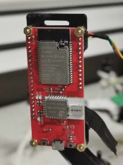

# Hardware

We use the [ESP32 UWB DW3000](https://www.makerfabs.com/esp32-uwb-dw3000.html) board in the WROVER variant.



We connect to this board using the pin headers.

> :exclamation: Only use the USB port to connect to the ESP32 during testing, and never when operating a robot.

The relevant pins are on the 'short' pin row on the ESP32 as shown below (Warning: NOT drawn to scale. Note ordering of pins only!)

``` text
____________
|x |    | x| 5V
|x |    | x| GND
|x |    | x| TX
|x |    | x| RX
|x |    | x|
|x |____| x|
|x        x|
|x         |
|x         |
|x         |
------------
```

> :warning: If possible, directly solder cables to the ESP32; Otherwise, hot glue Dupont connectors to the board
